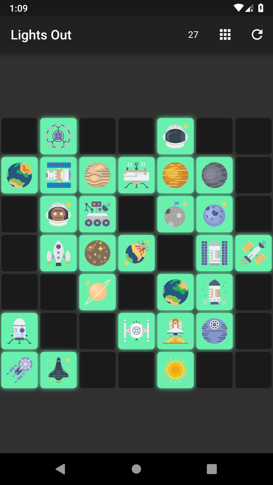
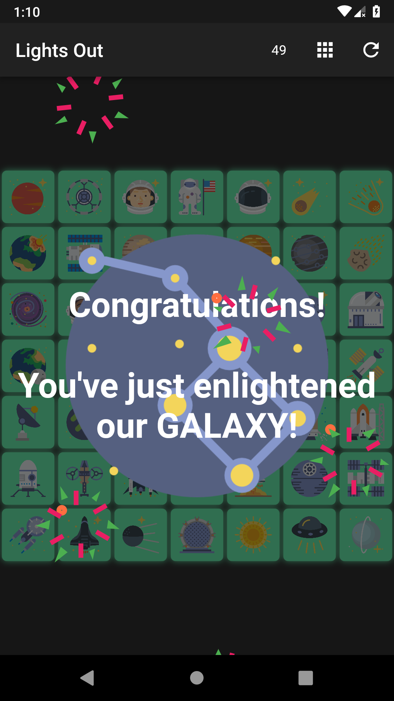

# lights_out

LightsOut is a flutter implementation of the classic LightsOut search problem.
> This project is meant to be my contribution in #FlutterCreate

> 🎉 **I won a 'Google Home Mini' for my participation in the contest.** You can find my name here: https://medium.com/flutter-io/the-flutter-create-winners-are-40980f2d20b3

Gameplay             |  Winning
:-------------------------:|:-------------------------:
  |  

## Resources
- [Space Flat Icons](https://www.flaticon.com/packs/space-3)
- [Blop Sound](http://soundbible.com/2067-Blop.html)
- [Ta Da Sound](http://soundbible.com/1003-Ta-Da.html)
## Getting Started

This project is a starting point for a Flutter application.

A few resources to get you started if this is your first Flutter project:

- [Lab: Write your first Flutter app](https://flutter.io/docs/get-started/codelab)
- [Cookbook: Useful Flutter samples](https://flutter.io/docs/cookbook)

For help getting started with Flutter, view our 
[online documentation](https://flutter.io/docs), which offers tutorials, 
samples, guidance on mobile development, and a full API reference.
